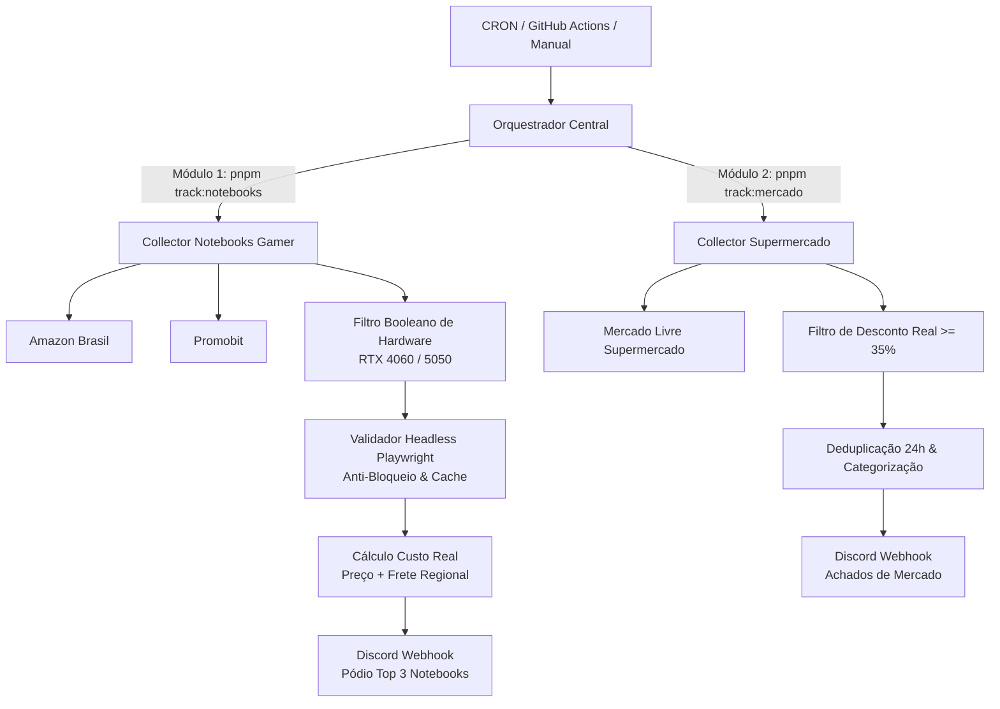

# ⚡ Price Tracker

> **Sistema modular e automatizado de monitoramento de preços, cálculo de custo real (à vista + frete regional), validação headless via Playwright e alertas no Discord.**

[](https://github.com/AdleyRodrigues/price-tracker/actions/workflows/monitor.yml)
[](https://github.com/AdleyRodrigues/price-tracker/actions/workflows/supermercado.yml)
[](https://github.com/AdleyRodrigues/price-tracker)
[](LICENSE)

---

## 📖 Origem & Evolução do Projeto (Veio pelo LinkedIn? 👋)

Se você chegou aqui através da minha [publicação no LinkedIn](https://www.linkedin.com/in/adley-castro/), seja muito bem-vindo!

### ❄️ Como tudo começou: *O robô caçador de Ar-Condicionado LG*
O projeto nasceu de uma dor pessoal muito comum ao comprar eletrodomésticos na internet:
1. **Confusão de SKUs e Modelos:** Uma única letra no código do produto (como `S3-Q09AA31F` vs `S3-Q09AA33F`) pode significar serpentina de alumínio em vez de cobre ou a ausência de comandos de voz e inteligência artificial.
2. **A Ilusão do "Preço de Vitrine":** Muitas lojas exibem um valor atraente na busca, mas ao informar o CEP, o frete abusivo anula qualquer desconto real.
3. **Trabalho Braçal e Repetitivo:** Abrir 5 a 10 abas diariamente em lojas diferentes para verificar oscilações de preço.

Para resolver isso, criei um script de automação e web scraping focado no modelo exato do **LG Dual Inverter Voice 9.000 BTUs**:
* Variava simultaneamente a **Loja Oficial LG**, **Amazon Brasil** e a comunidade do **Promobit**;
* Ignorava produtos similares ou modelos inferiores via regex rigoroso de SKU;
* Calculava automaticamente o **frete para o CEP de destino**, somava ao preço à vista e gerava o **Custo Total Real**;
* Enviava diariamente um **Top 3 (Pódio)** no Discord pelo menor preço final.

---

### 🔄 A Evolução: *De LG Tracker para um Price Tracker Modular*
Após o objetivo original ser concluído com sucesso e o ar-condicionado comprado no melhor preço histórico, decidi não descartar a ferramenta.

Por ser um projeto pessoal e vivo, **desacoplei o domínio rígido de ar-condicionado e transformei o repositório em uma engine genérica e modular de monitoramento**. Hoje, basta plugar novos scrapers, filtros e regras para rastrear qualquer categoria de produto conforme as minhas necessidades de consumo atuais.

---

## 🎯 Módulos Atualmente Ativos



---

### 1. 💻 Monitor de Notebooks Gamer (RTX 4060 / RTX 5050)
* **Ponto de entrada:** `src/tracker.ts` (`pnpm start` ou `pnpm track:notebooks`)
* **Lojas monitoradas:** Amazon Brasil (Vitrines de busca e PDPs) e Promobit (APIs JSON e cards HTML da comunidade).
* **Filtros de Hardware:**
  - **Inclusão:** Exige obrigatoriamente `('notebook' OU 'laptop')` **E** `('4060' OU '5050')`.
  - **Exclusão:** Bloqueia automaticamente desktops, PCs montados, placas de vídeo avulsas, periféricos (suportes, mesas, fontes, coolers, gabinetes, teclados, monitores) e produtos usados.
  - **Piso de Corte:** R$ 3.800,00 (elimina acessórios e falsos positivos).
* **Validação Real com Playwright:** Abre o Top 5 final em Chromium headless com bloqueio de mídia e rastreadores para checar estoque e confirmar o menor preço em ~10 segundos.
* **Alertas no Discord:** Embed rico com pódio ordenado pelo custo total real (à vista + frete para o CEP regional), indicação de cupom e menção sonora (`@user`) para ofertas abaixo do teto de oportunidade.

---

### 2. 🛒 Monitor de Achados de Supermercado (Mercado Livre)
* **Ponto de entrada:** `src/tracker-supermercado.ts` (`pnpm track:mercado`)
* **Lojas monitoradas:** Vitrines e promoções do Mercado Livre Supermercado.
* **Critérios de Curadoria:**
  - Filtra produtos com **pelo menos 35% de desconto real**.
  - Categorização automática em: *🧼 Limpeza*, *🥫 Alimentos & Bebidas* e *🪥 Higiene Pessoal*.
  - Histórico de ofertas (`data/alertas-enviados.json`) com janela deslizante de 24h para evitar notificações repetidas.
* **Alertas no Discord:** Embed categorizado com percentual de desconto, preço riscado e link direto.

---

## 🏗️ Arquitetura do Repositório

```text
price-tracker/
├── src/
│   ├── config/
│   │   ├── catalogo.ts             # Alvos de busca e parâmetros de produtos
│   │   ├── regras.ts               # Regex de hardware, fretes e pisos de preço
│   │   ├── regras-supermercado.ts  # URLs e thresholds de desconto de supermercado
│   │   ├── env.ts                  # Carregamento seguro e tipado de variáveis de ambiente
│   │   └── http.ts                 # Cliente Axios com User-Agents reais e timeouts
│   ├── domain/
│   │   ├── filtros.ts              # Regras de inclusão/exclusão de hardware
│   │   ├── filtros-supermercado.ts # Regras e categorização de supermercado
│   │   └── ranking.ts              # Ordenação por custo real e formação de pódio
│   ├── scrapers/
│   │   ├── amazon.ts               # Parser de vitrines e buyboxes da Amazon
│   │   ├── promobit.ts             # Scraper de API JSON e cards HTML do Promobit
│   │   ├── mercado-livre-supermercado.ts # Coletor de promoções do Mercado Livre
│   │   └── index.ts                # Registry central de scrapers ativos
│   ├── services/
│   │   ├── collector.ts            # Fan-out paralelo e deduplicação de ofertas
│   │   ├── discord.ts              # Formatador e despachante de embeds do monitor principal
│   │   ├── discord-supermercado.ts # Formatador de embeds de supermercado
│   │   ├── alertas-enviados.ts     # Cache local de ofertas já notificadas
│   │   └── verificador-playwright.ts # Validador headless com bloqueio de recursos
│   ├── tracker.ts                  # Orquestrador do monitor de notebooks
│   └── tracker-supermercado.ts     # Orquestrador do monitor de supermercado
├── .github/workflows/
│   ├── monitor.yml                 # CI/CD: Notebooks Gamer (Playwright cache + Concurrency)
│   └── supermercado.yml            # CI/CD: Supermercado (Cache de estado + Concurrency)
├── tests/                          # Suíte com 65 testes unitários e de integração (Vitest)
├── package.json
└── tsconfig.json
```

---

## 🚀 Como Rodar o Bot por Conta Própria

Se você é dev e quer rodar o bot na sua máquina ou customizar para os seus próprios produtos:

### Pré-requisitos
* **Node.js 20+**
* **pnpm** (`npm i -g pnpm`)

### 1. Clonar e Instalar
```bash
git clone https://github.com/AdleyRodrigues/price-tracker.git
cd price-tracker
pnpm install
```

### 2. Configurar Variáveis de Ambiente (`.env`)
Crie um arquivo `.env` na raiz do projeto:
```env
# Webhook do Discord para o monitor principal (Notebooks)
WEBHOOK_URL="https://discord.com/api/webhooks/SEU_WEBHOOK_NOTEBOOKS"

# Webhook do Discord para o monitor de supermercado
DISCORD_SUPERMERCADO_WEBHOOK_URL="https://discord.com/api/webhooks/SEU_WEBHOOK_SUPERMERCADO"

# CEP regional para cálculo de frete e custo real
CEP_DESTINO="01001-000"

# (Opcional) ID do usuário no Discord para ser mencionado em super promoções
USER_ID="123456789012345678"
```

### 3. Executar os Rastreadores
```bash
# Executar monitor de Notebooks Gamer (RTX 4060 / 5050)
pnpm start
# ou: pnpm track:notebooks

# Executar monitor de Supermercado (Mercado Livre)
pnpm track:mercado
```

### 4. Rodar a Suíte de Testes
```bash
pnpm test
```

---

## ☁️ Automação 100% Serverless no GitHub Actions

O projeto roda de forma autônoma na nuvem através do GitHub Actions, sem custo de infraestrutura:

| Workflow | Frequência | Otimizações de Performance |
|----------|------------|-----------------------------|
| **Monitor - Notebooks Gamer** (`monitor.yml`) | A cada 4 horas (`0 */4 * * *`) ou manual | Cache de binários do Playwright, cancel-in-progress, timeout de 5m |
| **Monitor de Ofertas - Supermercado** (`supermercado.yml`) | A cada 2 horas (`0 */2 * * *`) ou manual | Cache do arquivo `data/alertas-enviados.json`, cancel-in-progress |

### Disparo Manual via GitHub CLI (`gh`):
```bash
# Disparar monitor de notebooks
gh workflow run monitor.yml
gh run watch

# Disparar monitor de supermercado
gh workflow run supermercado.yml
gh run watch
```

---

## 🛡️ Destaques de Engenharia & Performance

* **Zero Hardcoded Secrets / PII:** Nenhuma credencial de webhook, token ou dado pessoal reside no código versionado; tudo é injetado via `.env` ou GitHub Secrets.
* **Playwright Otimizado:** Intercepta e aborta requisições pesadas (`image`, `media`, `font`, `stylesheet`) e rastreadores/analytics (`google-analytics`, `facebook`, `criteo`), reduzindo o tempo de validação do Top 5 em mais de 50%.
* **Resiliência e Timeouts Estritos:** Todas as requisições HTTP utilizam `AbortSignal.timeout(10000)` para garantir que a esteira nunca fique travada por conexões zumbis.
* **Testabilidade:** 65 testes automatizados cobrindo parsing de HTML, regex de inclusão/exclusão, deduplicação e formação de pódio.

---

## 📄 Licença

Distribuído sob a licença ISC. Desenvolvido por **[Adley Rodrigues](https://github.com/AdleyRodrigues)**.
Se este projeto foi útil para você ou serviu de inspiração, deixe uma ⭐️ no repositório!
